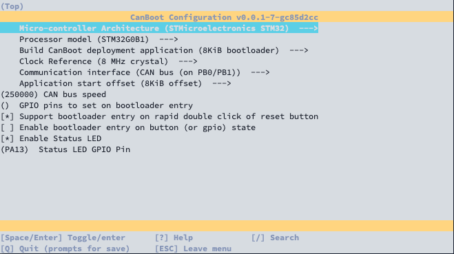
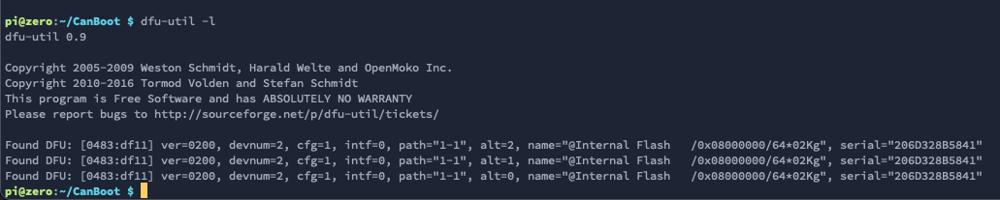
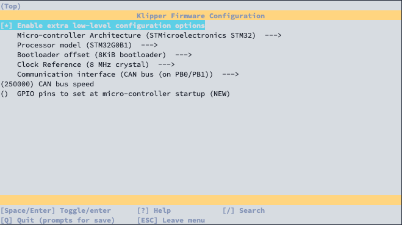
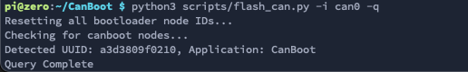
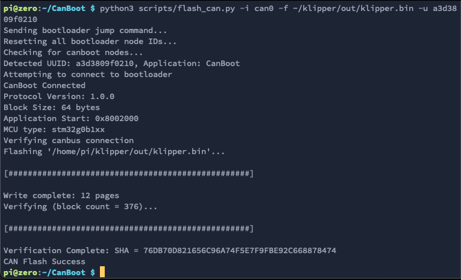

# BigTreeTech EBB36 v1.1
This is an instruction to set up the BTT EBB36 with clipper via CANBUS.

> Use at least a Klipper version of v1.0 to use the board safely! In this commit, Kevin fixed a bug in the ADC
> calculation of the STM32G0.

## Install/Download CanBoot on your SBC
CanBoot is a bootloader for MCUs to be able to update/flash them via CANBUS.
```bash
cd ~
git clone https://github.com/Arksine/CanBoot
```

## Config CanBoot for the BTT EBB36 v1.1
Open the config dialog with the following commands:
```bash
cd ~/CanBoot
make menuconfig
```
and use following config settings:
- Micro-controller Architecture: **STMicroelectronics STM32**
- Processor model: **STM31B0B1**
- Build CanBoot deployment application: **8KiB bootloader**
- Clock Reference: **8 MHz crystal**
- Communication interface: **CAN bus (on PB0/PB1)**
- Enable Status LED: **check**
- Status LED GPIO Pin: **PA13**

this should then look like this:  


use `q` for exit and `y` for save these settings.

## Compile bootloader
These lines just clear the cache and compile the CanBoot bootloader.
```bash
make clean
make
```

## Flash bootloader to BTT EBB36 v1.1
> **IMPORTANT**: before you start the flashing process, disconnect the heater from the board! Up to version v1.1, the
> heater output is switched to on in DFU mode while in this mode! This can lead to a fire! In version v1.2, this pin has
> changed because of this issue.

First, you have to put the board into DFU mode. To do this, press and hold the boot button and then disconnect and
reconnect the power supply, or press the reset button on the board. With the command `dfu-util -l`, you can check if the
board is in DFU mode. It should then look like this:  
  

If this is not the case, repeat the boot/restart process and test it again. If your board is in DFU mode, you can flash
it with the following command:
```bash
dfu-util -a 0 -D out/canboot.bin -s 0x08000000:mass-erase:force
```

## Config Klipper board firmware for EBB36 v1.1
Open the config interface of the Klipper firmware with following commands:
```bash
cd ~/klipper
make menuconfig
```
and set the following settings:
- Enable extra low-level configuration options: **check**
- Micro-controller Architecture: **STMicroelectronics STM32**
- Processor model: **STM32G0B1**
- Bootloader offset: **8KiB bootloader**
- Clock Reference: **8 MHz crystal**
- Communication interface: **CAN bus (on PB0/PB1)**
- CAN bus speed: 250000

The result should look like this:  


use `q` for exit and `y` for save these settings.

## Compile the Klipper firmware
```bash
make clean
make
```

## Flash Klipper via CanBoot
Find UUID of your BTT EBB36:
```bash
python3 ~/CanBoot/scripts/flash_can.py -i can0 -q
```

The output should look like this:  


With the UUID you have just read, you can now flash the board with:
```bash
python3 scripts/flash_can.py -i can0 -f ~/klipper/out/klipper.bin -u <uuid>
```


and with the following config you can num the board in Klipper:
```
[mcu EBB]
canbus_uuid: <uuid>
```