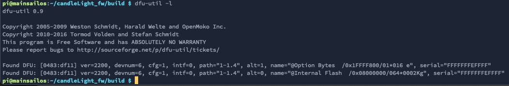
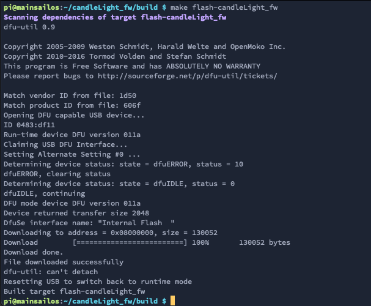
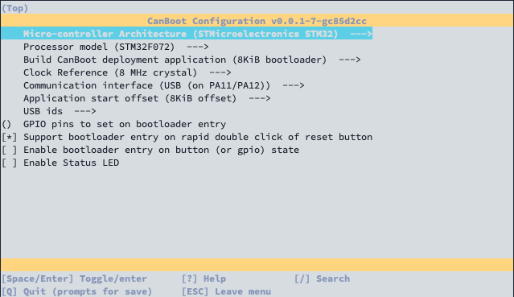
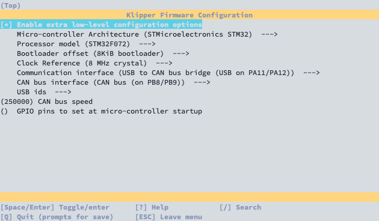
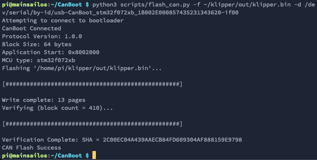

# BigTreeTech U2C
This is an instruction to set up the BTT U2C with Klipper. There are two possible variants. Use the board as a pure
CANBUS adapter (candlelight FW) or a Klipper USB-to-CAN adapter.

## CandleLight_FW (simple way - only U2C V1.x) 
CandleLight_FW is a firmware for STM32F042x/STM32F072xB based USB-CAN adapters.

Github: [github.com/candle-usb/candleLight_fw](https://github.com/candle-usb/candleLight_fw)

### Compile CandleLight_FW
```bash
# install requirements
sudo apt-get install cmake gcc-arm-none-eabi

cd ~
# clone git repo
git clone https://github.com/candle-usb/candleLight_fw
cd candleLight_fw

# create cmake toolchain
mkdir build
cd build
cmake .. -DCMAKE_TOOLCHAIN_FILE=../cmake/gcc-arm-none-eabi-8-2019-q3-update.cmake

# compile firmware
make candleLight_fw
```

### Flash CandleLight_FW to BTT U2C V1.x
First, the adapter must boot in DFU mode. Press the boot button and then connect the USB cable. With `dfu-util -l`, you
can check whether the adapter is booted in DFU mode. This should look like this:  

  

If the BTT U2C has booted in DFU mode, you can flash it with this command:
```bash
make flash-candleLight_fw
```

  

### Add can0 interface in mainsailOS
Now you only have to create the interface in the OS. to do this, create the file `/etc/network/interfaces.d/can0` and
fill it with the following content.

```bash
# open file with nano
sudo nano /etc/network/interfaces.d/can0
```

Content of `/etc/network/interfaces.d/can0`:
```
auto can0
iface can0 can static
    bitrate 250000
    up ifconfig $IFACE txqueuelen 128
```

To save and close the nano editor:  
`ctrl+o` => save dialog  
`ENTER` => confirm filename  
`ctrl+x` => close editor

After a reboot, the can interface should be ready.

## Klipper USB-to-CAN adapter (advanced way)
The Klipper MCU firmware has a function to run as a USB-to-CAN adapter. This has the advantage, especially with printer
boards with an integrated CAN interface, because it can be used as MCU and USB-to-CAN adapter simultaneously.
Unfortunately, this has a slight edge with the BTT U2C as no free pins are available.

### Flash CanBoot on the BTT U2C (optional)
This step is not necessary for this way, but it fits very well for this solution, and you can easily update the board
via CanBoot every time.

```bash
# download CanBoot
cd ~
git clone https://github.com/Arksine/CanBoot

# open CanBoot config dialog
cd ~/CanBoot
make menuconfig
```

Settings:
- Enable extra low-level configuration options: **check**
- Micro-controller Architecture: **STMicroelectronics STM32**
- Processor model: **STM32F072** *(U2C v1.x)*
- Processor model: **STM32G0B1** *(U2C v2.0)*
- Build CanBoot deployment application: **8KiB bootloader**
- Clock Reference: **8 MHz crystal**
- Communication interface: **USB (on PA11/PA12)**
- Application start offset: **8KiB offset**
- Support bootloader entry on rapid double click of reset button: **check**

  

`q` => Close  
`y` => Save  

After config all settings for the CanBoot bootloader, we have to compile it:
```bash
make clean
make 
```

To flash the Bootloader, we have to switch the board in the DFU mode again by holding the Boot button and unplugging and
plugging the USB cable. You can check it with `dfu-util -l`. If the board is in DFU mode, you can flash the Bootloader
with the following command:
```bash
dfu-util -a 0 -D ~/CanBoot/out/canboot.bin -s 0x08000000:mass-erase:force
```

You must reboot the board (unplugging/plugging) to check if the flash progress was successful. If you use the command
`ls /dev/serial/by-id/*` and you can see a path with `usb-CanBoot_stm32...`, it was successful. This output means that
the board was successfully booted in the CanBoot mode because it currently has no application firmware.

  

### Build Klipper MCU firmware with USB-to-CAN function
Open firmware config dialog:
```bash
cd ~/klipper
make menuconfig
```

Settings:
- Enable extra low-level configuration options: **check**
- Micro-controller Architecture: **STMicroelectronics STM32**
- Processor model: **STM32F072** *(U2C v1.x)*
- Processor model: **STM32G0B1** *(U2C v2.0)*
- Bootloader offset: **8KiB bootloader**
- Clock Reference: **8 MHz crystal**
- Communication interface: **USB to CAN bus bridge (USB on PA11/PA12)**
- CAN bus interface: **CAN bus (on PB8/PB9)**
- CAN bus speed: **250000**  

  

`q` => close  
`y` => save yes  

and now compile the Klipper firmware:
```bash
make clean
make
```

### Flash Klipper firmware via CanBoot
With the serial/by-id path we got above, we can flash the klipper firmware:
```bash
python3 ~/CanBoot/scripts/flash_can.py -f ~/klipper/out/klipper.bin -d <serial device>
```
(change <serial device> to the serial/by-id path from above)

  

After successfully flashing Klipper with USB-to-CAN, the board should no longer be listed as a serial device. From this
moment on, the board can only be controlled via CAN.

### Add can0 interface in mainsailOS
Now you only have to create the interface in the OS. to do this, create the file `/etc/network/interfaces.d/can0` and
fill it with the following content.

```bash
# open file with nano
sudo nano /etc/network/interfaces.d/can0
```

Content of `/etc/network/interfaces.d/can0`:
```
allow-hotplug can0
iface can0 can static
    bitrate 250000
    up ifconfig $IFACE txqueuelen 128
```

> The first line must be different here. Instead of `auto can0`, we use `allow-hotplug can0` because Klipper can
> restart the MCU, and the USB-to-CAN adapter is also restarted. Thus the OS can reactivate the interface automatically.

To save and close the nano editor:  
`ctrl+o` => save dialog  
`ENTER` => confirm filename  
`ctrl+x` => close editor

After a reboot, the can interface should be ready.

### Add BTT U2C in Klipper as a second MCU
Since you can only address the board via CAN, we must read out the UUID. This works with the following command:
```bash
~/klippy-env/bin/python ~/klipper/scripts/canbus_query.py can0
```


With the canbus_uuid, we can now define and use the board in the `printer.cfg`.

```
[mcu BTT_U2C]
canbus_uuid: <uuid>

# embedded temperature sensor
[temperature_sensor BTT_U2C]
sensor_type: temperature_mcu
sensor_mcu: BTT_U2C
min_temp: 0
max_temp: 100
```

### Short appendix about Klipper firmware updates
Since the board can only be addressed via CAN, further Klipper updates must also be flashed to the board via CAN. This
is very easy with the CanBoot bootloader:
```bash 
python3 ~/CanBoot/scripts/flash_can.py -i can0 -f ~/klipper/out/klipper.bin -u <uuid>
```