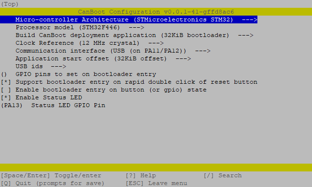
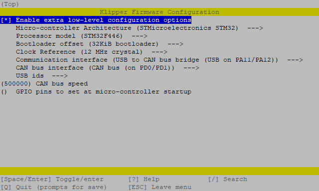

# BigTreeTech Octopus (Pro)

<br>
<p>This is an instruction to set up the BTT Octopus & Pro with Klipper via CANBUS.</p>
<br>
<p>There are two possible variants:</p>
<ul>
  <li>Scenario A) Use the board as a Klipper USB-to-CAN adapter</li>
  <li>Scenario B) Use the board completely over CAN - <i>(this part is not yet written)</i></li>
</ul>

<br>
<br>
<br>

<h2>
  <b>Instruction Index:</b>
</h2>
<br>
<ul>
  <li><a href="#canboot">CanBoot bootloader <i>(optional)</i></a></li>
  <ul>
    <li><a href="#canboot-download">Download</a></li>
    <li><a href="#canboot-config">Configuration</a></li>
    <li><a href="#canboot-flash">Flashing</a></li>
    <br>
    <li><a href="#canboot-update">Updating</a></li>
  </ul>
  <br>
  <br>
  <li><a href=" ">Klipper</a></li>
  <ul>
    <li><a href="#klipper-config">Configuration</a></li>
    <li><a href="#klipper-flash">Flashing</a></li>
    <li><a href="#klipper-can0">Add can0 interface</a></li>
    <li><a href="#klipper-mcu">Add as MCU to Klipper</a></li>
    <br>
    <li><a href="#klipper-update">Updating</a></li>
  </ul>
</ul>

<br>

<hr>

<h2 id="canboot">
  CanBoot bootloader <i>(optional)</i>
</h2>

<br>

<p><a href="https://github.com/Arksine/CanBoot">Canboot</a> is a bootloader for MCUs to be able to update/flash them via CANBUS.<br>With CanBoot there is no physical intervention (e.g. pressing the boot button) required to flash/update firmware to the MCUs.</p>
<p>Canboot is not mandatory to get klipper running - choose yourself if you like to use it or not.<br><i>If you do not like to use it start at the <a href="#klipper">Klipper</a> section.</i></p>

<br>

<hr>

<h3 id="canboot-download">
  Download Canboot
</h3>

Download CanBoot on your SBC.

```bash
cd ~
git clone https://github.com/Arksine/CanBoot
```

Add CanBoot to your moonraker update manager *(optional)*.

```yaml
[update_manager canboot]
type: git_repo
origin: https://github.com/Arksine/CanBoot.git
path: ~/CanBoot
is_system_service: False
```

<h3 id="canboot-config">
  Configure CanBoot for the BTT Octopus
</h3>

Open the config dialog with the following commands:

```bash
cd ~/CanBoot
make menuconfig
```

and use following config settings for your matching processor model:

- Micro-controller Architecture: **STMicroelectronics STM32**
- Processor model: **STM32F407**
- Processor model: **STM32F429**
- Processor model: **STM32F446**
- Build CanBoot deployment application: **32KiB bootloader**
- Clock Reference: **8 MHz crystal**   *(F407 & F429)*
- Clock Reference: **12 MHz crystal**   *(F446)*
- Communication interface: **USB (on PA11/PA12)**
- Application start offset: **32KiB offset**
- Support bootloader entry on rapid double click of reset button: **check** *(optional but recommend)*
- Enable Status LED: **check**
- Status LED GPIO Pin: **PA13**

this should then look like this *(F446 here)*:

<p align="center"></p>

use `q` for exit and `y` for save these settings.

These lines just clear the cache and compile the CanBoot bootloader.

```bash
make clean
make
```

<br>

<h3 id="canboot-flash">
  Flash the CanBoot bootloader to the BTT Octopus
</h3>

First, you have to put the board into DFU mode. \
To do this, press and hold the boot button and then disconnect and reconnect the power supply, 
or press the reset button on the board. \
With the command `dfu-util -l`, you can check if the board is in DFU mode.

If `dfu-util` can discover a board in DFU mode it should then look like this *(F446 here)*:

<p align="center"></p>

If this is not the case, repeat the boot/restart process and test it again.

<br>

If your board is in DFU mode, you can flash it with the following command:

```bash
dfu-util -a 0 -D ~/CanBoot/out/canboot.bin -s 0x08000000:mass-erase:force:leave
```

> *`Error during download get_status` can be ignored !*

<p align="center"></p>

Now double press the reset button and if the flash process was successfully one led should blink now.

<br>

<hr style="width:90%">

<br>

<h3 id="canboot-update">
  Update CanBoot ...
</h3>

<br>

<ul><li><details><summary>... the classic way with an USB cable + <code>dfu-util</code> and without CanBoot <i>(click to expand)</i></summary>

<br>

First, you have to put the board into DFU mode. \
To do this, press and hold the boot button and then disconnect and reconnect the power supply, 
or press the reset button on the board. \
With the command `dfu-util -l`, you can check if the board is in DFU mode.

It should then look like this *(F446 here)*:

<p align="center"></p>

If this is not the case, repeat the boot/restart process and test it again.

<br>

If your board is in DFU mode, you can flash it with the following command:

```bash
dfu-util -a 0 -D ~/CanBoot/out/canboot.bin -s 0x08000000:leave
```

> *`Error during download get_status` can be ignored !*

<p align="center"></p>

Now double press the reset button and if the flash process was successfully one led should blink now.

<br>

<hr style="width:90%">

</li></details> <!-- end of "canboot update with dfu-util" -->

<br>

<li><details><summary>... with the help of CanBoot itself <i>(click to expand)</i></summary>

<br>

Since the board can only be addressed via CAN, further CanBoot/Klipper updates must also be flashed to the board via CAN. \
This is very easy with the CanBoot bootloader:

```bash
# restart the mcu into CanBoot
python3 ~/CanBoot/scripts/flash_can.py -r -i can0 -u <uuid>
# the status led should blink now in bootloader mode
#
# find your <serial device> full path
ls /dev/serial/by-id/*
# the result should start with "/dev/serial/by-id/usb-CanBoot_stm32f446xx..."
#
# and update CanBoot
python3 ~/CanBoot/scripts/flash_can.py -f ~/CanBoot/out/canboot.bin -d <serial device>
```

<p align="center"></p>

</li></details> <!-- end of "canboot update with canboot" -->

</ul>

<br>

<hr>

<br>

<h2 id="klipper">
  Klipper
</h2>

<br>

<h3 id="klipper-config">
  Configure the Klipper firmware for the BTT Octopus (Pro)
</h3>

Open the config interface of the Klipper firmware with following commands:

```bash
cd ~/klipper
make menuconfig
```

and use following config settings for your matching processor model:

- Enable extra low-level configuration options: **check**
- Micro-controller Architecture: **STMicroelectronics STM32**
- Processor model: **STM32F407**
- Processor model: **STM32F429**
- Processor model: **STM32F446**
- Bootloader offset: **No bootloader** *(without CanBoot)*
- Bootloader offset: **32KiB bootloader** *(with CanBoot)*
- Clock Reference: **8 MHz crystal**   *(F407 & F429)*
- Clock Reference: **12 MHz crystal**   *(F446)*
- Communication interface: **USB to CAN bus bridge (USB on PA11/PA12)**
- CAN bus interface: **CAN bus (on PD0/PD1)**
- CAN bus speed: **500000**

The result should look like this *(F446 here)*:

<p align="center"></p>

use `q` for exit and `y` for save these settings.

Now compile the Klipper firmware:

```bash
make clean
make
```

<h3 id="klipper-flash">
  Flash Klipper ...
</h3>

<br>

<details><summary>... the classic way with an USB cable + <code>dfu-util</code> and without CanBoot <i>(click to expand)</i></summary>

<br>

First, you have to put the board into DFU mode. \
To do this, press and hold the boot button and then disconnect and reconnect the power supply, 
or press the reset button on the board. \
With the command `dfu-util -l`, you can check if the board is in DFU mode.

It should then look like this:

<p align="center"></p>

If this is not the case, repeat the boot/restart process and test it again.

<br>

If your board is in DFU mode, you can flash it with the following command: *(wait ~45s until the command finishes)*

```bash
dfu-util -a 0 -D ~/klipper/out/klipper.bin -s 0x08000000:mass-erase:force:leave
```

> *`Error during download get_status` can be ignored !*

<p align="center"></p>

<br>

<hr style="width:90%">

<br>

</details><!-- end of "flash klipper - dfu-util" -->

<br>

<details><summary>... with the help of CanBoot <i>(click to expand)</i></summary>

<br>

`TEXT TO BE WRITTEN`

```bash
# find your <serial device> full path
ls /dev/serial/by-id/*
# the result should be `/dev/serial/by-id/usb-CanBoot_stm32f446_...`
#
# and update Klipper
python3 ~/CanBoot/scripts/flash_can.py -f ~/klipper/out/klipper.bin -d <serial device>
```

<p align="center"></p>

<br>

<hr style="width:90%">

</details><!-- end of "flash Klipper - CanBoot" -->

<br>

<h3 id="klipper-can0">
  Add can0 interface in mainsailOS
</h3>

Now you only have to create the interface in the OS. \
To do this, create the file `/etc/network/interfaces.d/can0` and fill it with the following content.

```bash
# open file with nano
sudo nano /etc/network/interfaces.d/can0
```

Content of `/etc/network/interfaces.d/can0`:

```
allow-hotplug can0
iface can0 can static
    bitrate 500000
    up ifconfig $IFACE txqueuelen 128
```

To save and close the nano editor:  
`ctrl+s` => save file  
`ctrl+x` => close editor

After a reboot, the can interface should be ready.

<h3 id="klipper-mcu">
  Add the Octopus as a MCU to Klipper
</h3>

Now add the Octopus (Pro) to your Klipper `printer.cfg` with its UUID - *(discover instructions below)*.

```yaml
[mcu]
canbus_uuid: <uuid>

# embedded temperature sensor
[temperature_sensor Octopus]
sensor_type: temperature_mcu
min_temp: 0
max_temp: 100
```

If you do not use CanBoot and want to find the UUID of your Octopus use this command:

```bash
~/klippy-env/bin/python ~/klipper/scripts/canbus_query.py can0
```

The output should look like this:

<p align="center"></p>

<p><i>CanBoot users have already discovered their UUID at the <a href="#klipper-flash">Flash Klipper ... with the help of CanBoot</a> section</i></p>

<br>

<hr>

<h3 id="klipper-update">
  Update Klipper ...
</h3>

<br>

... the classic way with an USB cable + <code>dfu-util</code> and without CanBoot

<ul>
  <li>continue if you would <a href="#klipper-flash">flash Klipper for the first time</a></li>
</ul>

<br>

<details><summary>... with the help of CanBoot <i>(click to expand)</i></summary>

<br>

Since the board can only be addressed via CAN, Klipper must also be flashed to the board via CAN. \
This is very easy with the CanBoot bootloader:

```bash
# restart the mcu into CanBoot
python3 ~/CanBoot/scripts/flash_can.py -r -i can0 -u <uuid>
# the status led should blink now in bootloader mode
#
# find your <serial device> full path
ls /dev/serial/by-id/*
# the result should start with "/dev/serial/by-id/usb-CanBoot_stm32f446xx..."
#
# and update CanBoot
python3 ~/CanBoot/scripts/flash_can.py -f ~/CanBoot/out/canboot.bin -d <serial device>
```

<p align="center"></p>

</details>
