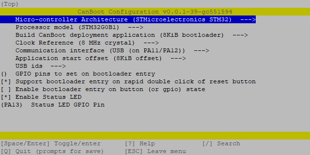

# BigTreeTech U2C

<br>
<p>These are instructions to set up the BTT U2C with Klipper.</p>
<br>
<p>There are two possible variants:</p>
<ul>
  <li>Use the board as a pure CANBUS adapter (candlelight FW)</li>
  <li>or as a Klipper USB-to-CAN adapter (Klipper bridge mode)</li>
</ul>

<br>
<br>
<br>

<h2>
  <b>Instruction Index:</b>
</h2>
<br>
<ul>
  <li><a href="#candlelight">Candlelight (simple way)</a></li>
  <ul>
    <li><a href="#candlelight-compile">Compile CandleLight</a></li>
    <li><a href="#candlelight-flash">Flashing</a></li>
    <li><a href="#candlelight-can0">Add can0 interface</a></li>
  </ul>
  <br>
  <br>
  <br>
  <li><details><summary><a href="#klipper">Klipper USB-to-CAN bridge mode</a> (advanced way) - <i>(click here to expand)</i></summary>
  <br>
  <br>
  <ul>
    <li><a href="#canboot">CanBoot bootloader <i>(optional)</i></a></li>
    <ul>
      <li><a href="#canboot-download">Download</a></li>
      <li><a href="#canboot-config">Configuration</a></li>
      <li><a href="#canboot-flash">Flashing</a></li>
      <br>
      <li><a href="#canboot-update">Updating</a></li>
    </ul>
    <br>
    <li><a href=" ">Klipper</a></li>
    <ul>
      <li><a href="#klipper-config">Configuration</a></li>
      <li><a href="#klipper-flash">Flashing</a></li>
      <li><a href="#klipper-can0">Add can0 interface</a></li>
      <li><a href="#klipper-mcu">Add U2C as additional MCU to Klipper</a></li>
      <br>
      <li><a href="#klipper-update">Updating</a></li>
    </ul>
  </details>
</ul>

<br>
<br>
<br>

<hr>

<br>

<h1 id="candlelight">
  CandleLight_FW (simple way)
</h1>

<br>

<p>CandleLight_FW is a firmware for STM32F042x/STM32F072xB based USB-CAN adapters.<br>
This is the right firmware for the U2C v1.x<br>
<a href="https://github.com/candle-usb/candleLight_fw">github.com/candle-usb/candleLight_fw</a></p>
<br>
<p>But the U2C v2.x has the STM32G0B1 that currently is not supported by the official CandleLight project.<br>
Therefore BTT created a fork of that project and added STM32G0B1 support<br>
<a href="https://github.com/bigtreetech/candleLight_fw/tree/stm32g0_support">github.com/bigtreetech/candleLight_fw/tree/stm32g0_support</a></p>

<br>

<h3 id="candlelight-compile">
  Compile candleLight_fw
</h3>

```bash
# install requirements
sudo apt install cmake gcc-arm-none-eabi

cd ~

# clone the right git repo
#
# for U2C v1.x:
git clone --depth=1 https://github.com/candle-usb/candleLight_fw
# for U2C v2.x:
git clone --depth=1 -b stm32g0_support https://github.com/bigtreetech/candleLight_fw

cd ~/candleLight_fw

# create cmake toolchain
mkdir build
cd build
cmake .. -DCMAKE_TOOLCHAIN_FILE=../cmake/gcc-arm-none-eabi-8-2019-q3-update.cmake

# compile candlelight_fw
#
# for U2C v1.x:
make candleLight_fw
# for U2C v2.x:
make budgetcan_fw
```

<br>

<hr style="width:90%">

<br>

<h3 id="candlelight-flash">
  Flash candleLight_fw to the U2C
</h3>

First, you have to put the board into DFU mode. \
To do this, press and hold the boot button and then disconnect and reconnect the power supply. \
With the command `dfu-util -l`, you can check if the board is in DFU mode.

If `dfu-util` can discover a board in DFU mode it should then look like this:
<p align="center"></p>

If this is not the case, repeat the boot/restart process and test it again.

<br>

If the U2C has booted in DFU mode, you can flash it with this command:
```bash
# for U2C v1.x:
make flash-candleLight_fw
# for U2C v2.x:
make flash-budgetcan_fw
```
It should then look like this:
<p align="center"></p>

<hr style="width:90%">

<h3 id="candlelight-can0">
  Add can0 interface in mainsailOS
</h3>

Now you only have to create the interface in the OS. \
To do this, create the file `/etc/network/interfaces.d/can0` and fill it with the following content.
```bash
# open file with nano
sudo nano /etc/network/interfaces.d/can0
```

Content of `/etc/network/interfaces.d/can0`:
```
auto can0
iface can0 can static
    bitrate 500000
    up ifconfig $IFACE txqueuelen 128
```

To save and close the nano editor:  
`ctrl+s` => save file  
`ctrl+x` => close editor

After a reboot, the can0 interface should be ready.

<br>
<br>
<br>

<hr>

<br>
<br>
<br>

<h1 id="klipper">
  Klipper USB-to-CAN adapter (advanced way)
</h1>

<br>

The Klipper MCU firmware has a function to run as a USB-to-CAN adapter. \
This has the advantage, especially with printer boards with an integrated CAN interface, 
because it can be used as MCU and USB-to-CAN adapter simultaneously.

Unfortunately, this has a slight edge with the U2C as no free pins are available.

<br>

<h2 id="canboot">
  CanBoot bootloader <i>(optional)</i>
</h2>

<br>

<p><a href="#https://github.com/Arksine/CanBoot">Canboot</a> is a bootloader for MCUs to be able to update/flash them via CANBUS.<br>With CanBoot there is no physical intervention (e.g. pressing the boot button) required to flash/update firmware to the MCUs.</p>
<p>Canboot is not mandatory to get klipper running - choose yourself if you like to use it or not.<br><i>If you do not like to use it start at the <a href="#klipper">Klipper</a> section.</i></p>

<br>

<hr>

<h3 id="canboot-download">
  Download Canboot
</h3>

Download CanBoot on your SBC.
```bash
cd ~
git clone https://github.com/Arksine/CanBoot
```

Add CanBoot to your moonraker update manager *(optional)*.

```yaml
[update_manager canboot]
type: git_repo
origin: https://github.com/Arksine/CanBoot.git
path: ~/CanBoot
is_system_service: False
```

<h3 id="canboot-config">
  Configure CanBoot for the BTT U2C
</h3>

Open the config dialog with the following commands:
```bash
cd ~/CanBoot
make menuconfig
```
and use following config settings for your matching processor model:

- Enable extra low-level configuration options: **check**
- Micro-controller Architecture: **STMicroelectronics STM32**
- Processor model: **STM32F072** *(U2C v1.x)*
- Processor model: **STM32G0B1** *(U2C v2.x)*
- Build CanBoot deployment application: **8KiB bootloader**
- Clock Reference: **8 MHz crystal**
- Communication interface: **USB (on PA11/PA12)**
- Application start offset: **8KiB offset**
- Support bootloader entry on rapid double click of reset button: **check**
- Enable Status LED: **check**
- Status LED GPIO Pin: **PA14** *(U2C v1.x)*
- Status LED GPIO Pin: **PA13** *(U2C v2.x)*

this should then look like this  
<p align="center"></p>

use `q` for exit and `y` for save these settings.

These lines just clear the cache and compile the CanBoot bootloader.
```bash
make clean
make
```

<br>

<h3 id="canboot-flash">
  Flash the CanBoot bootloader to the BTT U2C
</h3>

First, you have to put the board into DFU mode. \
To do this, press and hold the boot button and then disconnect and reconnect the power supply. \
With the command `dfu-util -l`, you can check if the board is in DFU mode.

If `dfu-util` can discover a board in DFU mode it should then look like this *(F446 here)*:

<p align="center"></p>

If this is not the case, repeat the boot/restart process and test it again.

<br>

If your board is in DFU mode, you can flash it with the following command:

```bash
dfu-util -a 0 -D ~/CanBoot/out/canboot.bin -s 0x08000000:mass-erase:force:leave
```

> *`Error during download get_status` can be ignored !*

<p align="center"></p>


If the flash process was successfully the status led should blink now. \
Also if you use the command `ls /dev/serial/by-id/*` and you can see a path with `usb-CanBoot_stm32g0b1xx_...`, it was successful. \
This output means that the board was successfully booted in the CanBoot mode because it currently has no application firmware. \
If this is not the case powercycle the board (unplug & replug the usb cable) and see if the status led now blinks.

<br>

<hr style="width:90%">

<br>

<h3 id="canboot-update">
  Update CanBoot ...
</h3>

<br>

<ul><li><details><summary>... the classic way with an USB cable + <code>dfu-util</code> and without CanBoot <i>(click to expand)</i></summary>

<br>

First, you have to put the board into DFU mode. \
To do this, press and hold the boot button and then disconnect and reconnect the power supply.

With the command `dfu-util -l`, you can check if the board is in DFU mode.

If `dfu-util` can discover a board in DFU mode it should then look like this *(F446 here)*:

<p align="center"></p>

If this is not the case, repeat the boot/restart process and test it again.

<br>

If your board is in DFU mode, you can flash it with the following command:
```bash
dfu-util -a 0 -D ~/CanBoot/out/canboot.bin -s 0x08000000:leave
```

> *`Error during download get_status` can be ignored !*

<p align="center"></p>

<br>

<hr style="width:90%">

</li></details> <!-- end of "canboot update with dfu-util" -->

<br>

<li><details><summary>... with the help of CanBoot itself <i>(click to expand)</i></summary>

<br>

Since the board can only be addressed via CAN, further CanBoot/Klipper updates must also be flashed to the board via CAN. \
This is very easy with the CanBoot bootloader:

Find the UUID of your U2C:

```bash
python3 ~/CanBoot/scripts/flash_can.py -i can0 -q
```

The output should look like this:
<p align="center"></p>

With the UUID you have just read, you can now update the board with:

```bash
# restart the mcu into CanBoot
python3 ~/CanBoot/scripts/flash_can.py -r -i can0 -u <uuid>
# the status led should blink now in bootloader mode
#
# find your <serial device> full path
ls /dev/serial/by-id/*
# the result should start with "/dev/serial/by-id/usb-CanBoot_stm32g0b1xx_..."
#
# and update CanBoot
python3 ~/CanBoot/scripts/flash_can.py -f ~/CanBoot/out/canboot.bin -d <serial device>
```

<p align="center"></p>

</li></details> <!-- end of "canboot update with canboot" -->

</ul>

<br>

<hr>

<br>

<h2 id="klipper">
  Klipper
</h2>

<br>

<h3 id="klipper-config">
  Configure the Klipper firmware for the BTT U2C
</h3>

Open the config interface of the Klipper firmware with following commands:
```bash
cd ~/klipper
make menuconfig
```
and use following config settings for your matching processor model:

- Enable extra low-level configuration options: **check**
- Micro-controller Architecture: **STMicroelectronics STM32**
- Processor model: **STM32F072** *(U2C v1.x)*
- Processor model: **STM32G0B1** *(U2C v2.x)*
- Bootloader offset: **8KiB bootloader**
- Clock Reference: **8 MHz crystal**
- Communication interface: **USB to CAN bus bridge (USB on PA11/PA12)**
- CAN bus interface: **CAN bus (on PB8/PB9)**
- CAN bus interface: **CAN bus (on PB5/PB6)** ❗ *PB5/6 are currently not yet available at the main klipper repository - be patient or use [candle_light](#candlelight_fw-simple-way)* ❗
- CAN bus speed: **500000**

The result should look like this:
<p align="center"></p>

use `q` for exit and `y` for save these settings.

Now compile the Klipper firmware:
```bash
make clean
make
```

<h3 id="klipper-flash">
  Flash Klipper ...
</h3>

<br>

<details><summary>... the classic way with an USB cable + <code>dfu-util</code> and without CanBoot <i>(click to expand)</i></summary>

<br>

First, you have to put the board into DFU mode. \
To do this, press and hold the boot button and then disconnect and reconnect the power supply, 
or press the reset button on the board. \
With the command `dfu-util -l`, you can check if the board is in DFU mode.

It should then look like this:
<p align="center"></p>

If this is not the case, repeat the boot/restart process and test it again.

<br>

If your board is in DFU mode, you can flash it with the following command:

```bash
dfu-util -a 0 -D ~/klipper/out/klipper.bin -s 0x08000000:mass-erase:force:leave
```

> *`Error during download get_status` can be ignored !*

<p align="center"></p>

<br>

<hr style="width:90%">

<br>

</details><!-- end of "flash klipper - dfu-util" -->

<br>

<details><summary>... with the help of CanBoot <i>(click to expand)</i></summary>

<br>

`TEXT TO BE WRITTEN`

```bash
# find your <serial device> full path
ls /dev/serial/by-id/*
# the result should start with "/dev/serial/by-id/usb-CanBoot_stm32g0b1xx..."
#
# and update Klipper
python3 ~/CanBoot/scripts/flash_can.py -f ~/klipper/out/klipper.bin -d <serial device>
```
<p align="center"></p>

<br>

<hr style="width:90%">

</details><!-- end of "flash Klipper - CanBoot" -->

<br>

<h3 id="klipper-can0">
  Add can0 interface in mainsailOS
</h3>

Now you only have to create the interface in the OS. \
To do this, create the file `/etc/network/interfaces.d/can0` and fill it with the following content.

```bash
# open file with nano
sudo nano /etc/network/interfaces.d/can0
```

Content of `/etc/network/interfaces.d/can0`:

```
allow-hotplug can0
iface can0 can static
    bitrate 500000
    up ifconfig $IFACE txqueuelen 128
```

> The first line must be different here. Instead of `auto can0`, we use `allow-hotplug can0` because Klipper can
> restart the MCU, and the USB-to-CAN adapter is also restarted. \
> Thus the OS can reactivate the interface automatically.

To save and close the nano editor:  
`ctrl+s` => save file  
`ctrl+x` => close editor

After a reboot, the can0 interface should be ready.

<h3 id="klipper-mcu">
  Add the U2C as a MCU to Klipper
</h3>

Now add the U2C to your Klipper `printer.cfg` with its UUID - *(discover instructions below)*.

```yaml
[mcu u2c]
canbus_uuid: <uuid>

# embedded temperature sensor
[temperature_sensor U2C]
sensor_type: temperature_mcu
min_temp: 0
max_temp: 100
```

If you do not use CanBoot and want to find the UUID of your U2C use this command:
```bash
~/klippy-env/bin/python ~/klipper/scripts/canbus_query.py can0
```

The output should look like this:
<p align="center"></p>

<p><i>CanBoot users have already discovered their UUID at the <a href="#klipper-flash">Flash Klipper ... with the help of CanBoot</a> section</i></p>

<br>

<hr>

<h3 id="klipper-update">
  Update Klipper ...
</h3>

<br>

... the classic way with an USB cable + `dfu-util` and without CanBoot

<ul>
  <li>continue if you would <a href="#klipper-flash">flash Klipper for the first time</a></li>
</ul>

<br>

<details><summary>... with the help of CanBoot <i>(click to expand)</i></summary>

<br>

Since the board can only be addressed via CAN, Klipper must also be flashed to the board via CAN. \
This is very easy with the CanBoot bootloader:

Find the UUID of your U2C:

```bash
python3 ~/CanBoot/scripts/flash_can.py -i can0 -q
```

The output should look like this:

<p align="center"></p>

With the UUID you have just read, you can now flash the board with:

```bash
# restart the mcu into CanBoot
python3 ~/CanBoot/scripts/flash_can.py -r -i can0 -u <uuid>
# the status led should blink now in bootloader mode
#
# find your <serial device> full path
ls /dev/serial/by-id/*
# the result should start with "/dev/serial/by-id/usb-CanBoot_stm32g0b1xx_..."
#
# and update klipper
python3 ~/CanBoot/scripts/flash_can.py -f ~/klipper/out/klipper.bin -d <serial device>
```

<p align="center"></p>

</details>
