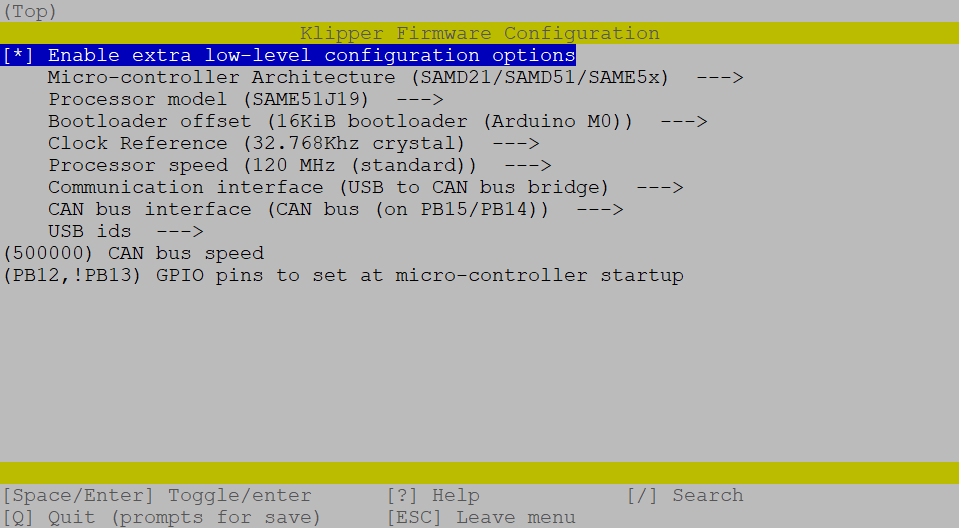

# Adafruit Feather M4 CAN Express

<br>

This is an instruction to set up the [Adafruit Feather M4 CAN Express](https://learn.adafruit.com/adafruit-feather-m4-can-express) with Klipper via CANBUS.

> ⚠ This is very WIP ⚠

<!--link bookmarks:
https://www.adafruit.com/product/4759
https://learn.adafruit.com/adafruit-feather-m4-can-express
https://learn.adafruit.com/adafruit-feather-m4-express-atsamd51/uf2-bootloader-details

-->

<br>

<h2>
  <b>Instruction Index:</b>
</h2>
<br>
<ul>

<!--

  <li><a href="#canboot">CanBoot bootloader <i>(optional)</i></a></li>
  <ul>
    <li><a href="#canboot-download">Download</a></li>
    <li><a href="#canboot-config">Configuration</a></li>
    <li><a href="#canboot-flash">Flashing</a></li>
    <br>
    <li><a href="#canboot-update">Updating</a></li>
  </ul>
  <br>
  <br>

-->

  <li><a href=" ">Klipper</a></li>
  <ul>
    <li><a href="#klipper-config">Configuration</a></li>
    <li><a href="#klipper-flash">Flashing</a></li>
    <br>
    <li><a href="#klipper-update">Updating</a></li>
  </ul>
</ul>

<br>

<hr>

<!--

<h2 id="canboot">
  CanBoot bootloader <i>(optional)</i>
</h2>

CanBoot is a bootloader for MCUs to be able to update/flash them via CANBUS. \
With CanBoot there is no physical intervention (e.g. double pressing the reset button) required to flash/update firmware to the MCUs.

<h3 id="canboot-download">
  Download Canboot
</h3>

Download CanBoot on your SBC.
```bash
cd ~
git clone https://github.com/Arksine/CanBoot
```

Add CanBoot to your moonraker update manager (optional).

```yaml
[update_manager canboot]
type: git_repo
origin: https://github.com/Arksine/CanBoot.git
path: ~/CanBoot
is_system_service: False
```

<h3 id="canboot-config">
  Configure CanBoot for the Feather
</h3>

Open the config dialog with the following commands:
```bash
cd ~/CanBoot
make menuconfig
```
and use following config settings:
- Micro-controller Architecture: **** ❌
- Processor model: **SAME51J19**
- Build CanBoot deployment application: **8KiB bootloader** ❌
- Clock Reference: **8 MHz crystal** ❌
- Communication interface: **USB (on PA11/PA12)** ❌
- Application start offset: **8KiB offset** ❌
- CAN bus speed: **500000**
- Support bootloader entry on rapid double click of reset button: **check** *(optional but recommend)*
- Enable Status LED: **check**
- Status LED GPIO Pin: **PA23**

this should then look like this:  
<p align="center"></p>

use `q` for exit and `y` for save these settings.

These lines just clear the cache and compile the CanBoot bootloader.
```bash
make clean
make
```
<h3 id="canboot-flash">
  Flash the CanBoot bootloader to the EBB
</h3>

First, you have to put the board into DFU mode. \
To do this, press and hold the boot button and then disconnect and reconnect the power supply, 
or press the reset button on the board. \
With the command `dfu-util -l`, you can check if the board is in DFU mode.

It should then look like this:  
<p align="center"></p>

If this is not the case, repeat the boot/restart process and test it again.

<br>

If your board is in DFU mode, you can flash it with the following command:
```bash
dfu-util -a 0 -D ~/CanBoot/out/canboot.bin -s 0x08000000:mass-erase:force
```
<p align="center"></p>

<br>

<hr style="width:90%">

<br>

<h3 id="canboot-update">
  Update CanBoot ...
</h3>

<br>

... the classic way with an USB cable and without CanBoot

<ul>
  <li>continue if you would <a href="#canboot-flash">flash CanBoot for the first time</a></li>
</ul>

<br>

<details><summary>... with the help of CanBoot itself <i>(click to expand)</i></summary>

<br>

Since the board can only be addressed via CAN, further Canboot updates must also be flashed to the board via CAN. \
This is very easy with the CanBoot bootloader:
```bash
python3 ~/CanBoot/scripts/flash_can.py -f -i can0 ~/CanBoot/out/canboot.bin -u <uuid>
```
<p align="center"></p>

</details>

<br>

<hr>

<br>

-->

<h2 id="klipper">
  Klipper
</h2>

<br>

<h3 id="klipper-config">
  Configure the Klipper firmware for the Feather M4 CAN
</h3>

Open the config interface of the Klipper firmware with following commands:
```bash
cd ~/klipper
make menuconfig
```
and set the following settings:
- Enable extra low-level configuration options: **check**
- Micro-controller Architecture: **(SAMD21/SAMD51/SAME5x)**
- Processor model: **SAME51J19**
- Bootloader offset: **16KiB bootloader (Arduino M0)**
- Clock Reference: **32.768Khz crystal**
- Processor speed: **120 MHz (standard)**
- Communication interface: **USB to CAN bus bridge**
- CAN bus interface: **CAN bus (on PB15/PB14)**
- CAN bus speed: **500000**
- GPIO pins to set at micro-controller startup: **!PB12,PB13** 

The result should look like this:  
<p align="center"></p>

use `q` for exit and `y` for save these settings.

Now compile the Klipper firmware:
```bash
make clean
make
```

<h3 id="klipper-flash">
  Flash Klipper ...
</h3>

<br>

<details><summary>... the classic way with an USB cable <!--and without CanBoot--> <i>(click to expand)</i></summary>
<br>

First, you have to put the board into bootloader mode. \
To do this, connect the feather to USB and then quickly double press the reset button.

Depending on your UF2 bootloader version the neopixel may rainbow or be a static green and the red LED may fade in and out.

If this is not the case, repeat the boot/restart process and test it again.

<br>

If your board is in bootloader mode, you can flash it with the following command:

> I had problems flashing the board if it was 10+ seconds in bootloader mode. \
> Be quick when resetting the board and executing the flash command.

```bash
# find your <serial device> full path
ls /dev/serial/by-id/*
# the result should start with "/dev/serial/by-id/usb-Adafruit_Industries_Feather_M4_CAN_Express_..."
#
# and flash klipper
make flash FLASH_DEVICE=<serial device>
```

<p align="center"></p>

<br>

<hr style="width:90%">

<br>

</details><!-- end of "flash klipper - classic" -->

<br>

<!--
<details><summary>... with the help of CanBoot <i>(click to expand)</i></summary>

<br>

Find the UUID of your M4:
```bash
python3 ~/CanBoot/scripts/flash_can.py -i can0 -q
```

The output should look like this:
<p align="center"></p>

With the UUID you have just read, you can now flash the board with:
```bash
# restart the mcu into CanBoot
python3 ~/CanBoot/scripts/flash_can.py -i can0 -r -u <uuid>
# find your <serial device> full path
ls /dev/serial/by-id/*
# the result should be `/dev/serial/by-id/usb-CanBoot_...`
#
# and update Klipper
python3 ~/CanBoot/scripts/flash_can.py -f ~/klipper/out/klipper.bin -d <serial device>
```
<p align="center"></p>

<br>

<hr style="width:90%">

</details><!-- end of "flash Klipper - CanBoot" -->

<br>

<h3 id="klipper-can0">
  Add can0 interface in mainsailOS
</h3>

Now you only have to create the interface in the OS. \
To do this, create the file `/etc/network/interfaces.d/can0` and fill it with the following content.
```bash
# open file with nano
sudo nano /etc/network/interfaces.d/can0
```

Content of `/etc/network/interfaces.d/can0`:
```
allow-hotplug can0
iface can0 can static
    bitrate 500000
    up ifconfig $IFACE txqueuelen 128
```

To save and close the nano editor:  
`ctrl+s` => save file  
`ctrl+x` => close editor

After a reboot, the can interface should be ready.


<h3 id="klipper-mcu">
  Add the M4 as a MCU to Klipper
</h3>

Now add the Feather M4 to your Klipper `printer.cfg` with its UUID - *(discover instructions below)*.

```yaml
[mcu M4-CAN]
canbus_uuid: <uuid>

# embedded temperature sensor
[temperature_sensor M4-CAN]
sensor_type: temperature_mcu
sensor_mcu: M4-CAN
min_temp: 0
max_temp: 100
```

If you <!--do not use CanBoot and -->want to find the uuid of your M4 use this command:
```bash
~/klippy-env/bin/python ~/klipper/scripts/canbus_query.py can0
```

The output should look like this:
<p align="center"></p>

<!--
<p><i>CanBus users have already discovered their uuid at the <a href="#klipper-flash">Flash Klipper ... with the help of CanBoot</a> section</i></p>
-->

<br>

<hr>

<h3 id="klipper-update">
  Update Klipper ...
</h3>

<br>

... the classic way with an USB cable <!--and without CanBoot-->

<ul>
  <li>continue if you would <a href="#klipper-flash">flash Klipper for the first time</a></li>
</ul>

<br>

<!--
<details><summary>... with the help of CanBoot <i>(click to expand)</i></summary>

<br>

Since the board can only be addressed via CAN, Klipper must also be flashed to the board via CAN. \
This is very easy with the CanBoot bootloader:
```bash
python3 ~/CanBoot/scripts/flash_can.py -i can0 -f ~/klipper/out/klipper.bin -u <uuid>
```
<p align="center"></p>

</details>
-->